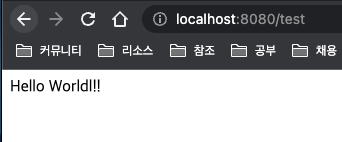

저는 펌웨어, 응용프로그램을 거쳐서 Python(DJango)로 서버 개발을 하는 중입니다.
앞으로도 서버 개발을 할 것 같아서 한국에서 가장 많이 사용하는 Java + Spring 조합을 공부하기로 했습니다.

Spring Boot는 Spring의 소문에 비해서는 확실히 자동으로 해주는 게 많은 것 같습니다.
근데 개인적으로 마법사가 뭐 많이 해주는 거 안 좋아합니다. 애초에 뭐가 얼마나 많길래 Boot 같은 게 나온 거야

​뭐 어쨌든 스프링 뉴비의 마음으로 사람들이 추천하는 이클립스를 깔아봅니다.
1분 만에 역시 이클립스는 아니었다고 자책하며 지웁니다.

​이번엔 스프링 전용으로 나온 STS4(이클립스 개조판)을 받습니다.
사람들의 평가도 상당히 좋고 쓰는 사람도 많아 보입니다. 이번엔 과연?

​이클립스 사용자들은 지옥에나 가세요 ㅋ 빠르게 지웁니다.
인텔리제이도 깔아볼까 하다가 회사 업무도 Pycharm 버리고 VSCode 쓰는 마당에 그냥 VSCode로 사용합니다.
공식 확장들이 있어서 깔아서 써보니 아주아주 쉽고 간편하게 잘됩니다.

​VSCode 쓰세요.

​일단 토이 프로젝트로 Todo 서버 개발을 해볼 건데 상당히 험난해 보입니다. DJango도 만만치 않게 귀찮은 녀석인데 얘는 더 심한 것 같습니다.

Hello World 띄우는 데 한 시간 걸림

### 참고 자료
- 이클립스, STS에서 Lombok 적용 시 에러가 나는 경우 [LomBok에러]의 첫번째 답변 참조
- m1을 쓰시는 분들을 위해 jdk 15 arm64 링크도 첨부해 드릴게요 [JDK]

[LomBok에러]: https://stackoverflow.com/questions/68117860/eclipse-2021-06-classformaterror-accessible-module-java-base-does-not-opens-j
[JDK]: https://www.azul.com/downloads/?version=java-15-mts&os=macos&architecture=arm-64-bit&package=jdk